

  

  

  <b>By builders, for builders.</b> 
  A one-person publication

<h1 align="center">Jaswant Vathanam</h1>

  <code>Filter by</code>&nbsp;&nbsp;<b>All</b>&nbsp;&middot;&nbsp;Deep Dives&nbsp;&middot;&nbsp;Experiments&nbsp;&middot;&nbsp;Open Source&nbsp;&middot;&nbsp;Conversations

<code>Deep Dive</code>

### [JurisAI — an AI legal assistant for Indian law workflows](https://github.com/JaswantVathanam/JurisAI)

Research and document automation grounded in real statutes, built for how legal work actually gets done.

2026.07.20

 

<code>Experiments</code>

### [NeuroPath — adaptive cognitive rehabilitation, one session at a time](https://github.com/JaswantVathanam/NeuroPath)

Personalized cognitive games, wellness activities, and therapist monitoring for neurodiverse users.

2026.06.15

 

<code>Open Source</code>

### [Smart-Care-Monitoring-System — real-time patient telemetry off ESP32](https://github.com/JaswantVathanam/Smart-Care-Monitoring-System)

A React + TypeScript dashboard talking to a Node.js serial-bridge backend, visualizing live vitals as they happen.

2026.05.02

 

<code>Conversations</code>

### Currently learning: cognitive science, legal NLP, and cloud computing

Notes from a final-year AI/ML student figuring out where research meets shipping — and where .NET fits into both.

2026.07.23

 

<code>Deep Dive</code>

### Academic Portals (SIS/EDU) — resilient systems for universities

Institutional platforms designed to stay dependable under the exact conditions that break most of them: registration week.

2026.03.11

 

  <a href="https://github.com/JaswantVathanam?tab=repositories">View more on GitHub &rarr;</a>

### `$env:TECH_STACK`

  
  
  
  
  
  
  
  

  

## 🪟 START

<code>PS C:\Jaswant&gt; Search-Apps</code>

<table>
<tr><td align="center" colspan="6"><b>Productivity</b></td></tr>
<tr>
<td></td>
<td>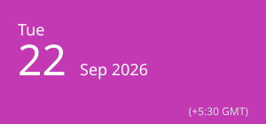</td>
<td>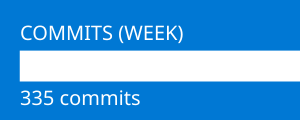</td>
<td>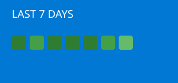</td>
<td>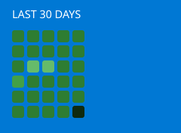</td>
<td>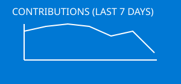</td>
</tr>
<tr><td align="center" colspan="4"><b>Developer</b></td></tr>
<tr>
<td>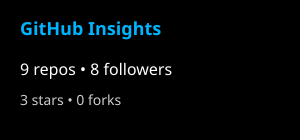</td>
<td>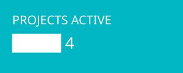</td>
<td></td>
<td>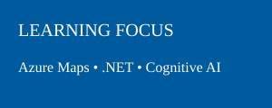</td>
</tr>
<tr><td align="center" colspan="3"><b>Explore</b></td></tr>
<tr>
<td>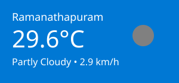</td>
<td></td>
<td>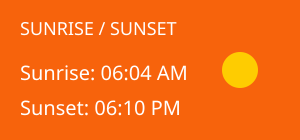</td>
</tr>
<tr><td align="center" colspan="3"><b>Social &middot; System</b></td></tr>
<tr>
<td></td>
<td></td>
<td>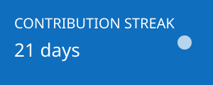</td>
</tr>
</table>

  Follow the build as it ships, breaks, and gets rebuilt. 
  &copy; 2026 A one-person publication 
  <a href="https://www.linkedin.com/in/jaswant-b-vathanam">LinkedIn</a> &middot; <a href="https://jaswantvathanam.github.io">Portfolio</a>

