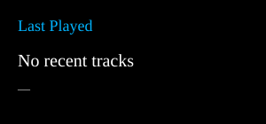
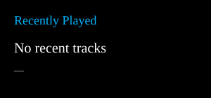
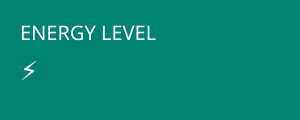

# 💫 About Me

Hi, I'm **Jaswant B** — a final‑year **B.Tech CSE (AI/ML)** student and a developer who loves building systems that feel reliable, intentional, and human‑centered.

I work at the intersection of **AI, .NET, cognitive science, and institutional platforms**, designing tools that make learning, recovery, and administration smoother for everyone.

### 🔭 What I’m Building
- **Cognitive Rehabilitation Platform (AI‑driven)** — adaptive recovery tools for neurodiverse users  
- **AI Legal Assistant** — intelligent research & document automation for law  
- **Academic Portals (SIS/EDU)** — resilient systems for universities  

### 👯 I’m Looking to Collaborate On
- AI/ML projects with real‑world impact  
- .NET applications  
- Educational and institutional systems  

### 🤝 I’m Looking for Help With
- Cloud‑native deployment  
- Legal domain modeling for AI  

### 🌱 Currently Learning
- Cognitive science + AI  
- Legal NLP & ontology design  
- Cloud computing  
- .NET ecosystem  

### 💬 Ask Me About
- Academic portals (SIS/EDU)  
- .NET development  
- AI/ML in education, healthcare, and law  

### ⚡ Fun Fact
I treat clarity as a form of care — every system, module, or document I build is a quiet act of leadership.

---
<!-- WINDOWS SYSTEM MODE -->

<!-- START HEADER -->
<h1 style="margin-top:0; font-weight:700;">START</h1>

<table>
<tr>

<!-- LEFT SIDE -->
<td width="220" valign="top" style="color:white;">

<b>Recently added</b> 
• Live Tiles Engine  

<b>A</b> 
• About Me 
• Activity Feed  

<b>C</b> 
• Calendar 
• Commits 
• Contribution Graph  

<b>D</b> 
• Developer Stats 
• Dashboard  

<b>P</b> 
• Projects 
• Productivity  

<b>S</b> 
• Social 
• Spotify 
• Settings  

<b>T</b> 
• Tools 

</td>

<!-- RIGHT SIDE -->
<td valign="top" style="color:white;">

<!-- Productivity -->
<h3>Productivity</h3>

<!-- Developer -->
<h3 style="margin-top:25px;">Developer</h3>

<!-- Tools -->
<h3 style="margin-top:25px;">Tools</h3>

<!-- Explore -->
<h3 style="margin-top:25px;">Explore</h3>

<!-- Social -->
<h3 style="margin-top:25px;">Social</h3>

<!-- System -->
<h3 style="margin-top:25px;">System</h3>

</td>

</tr>
</table>

